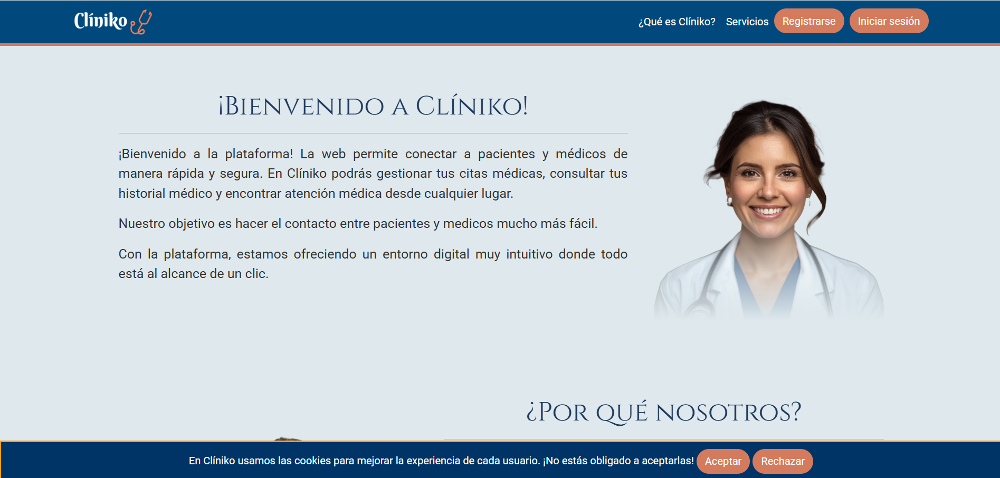
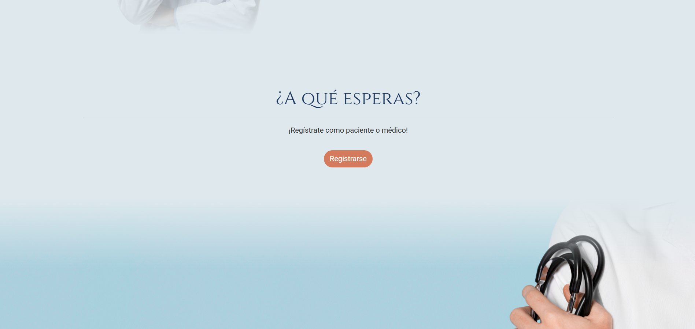
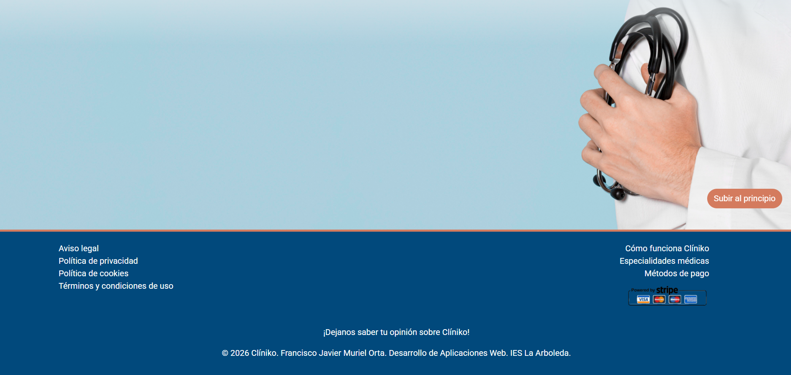
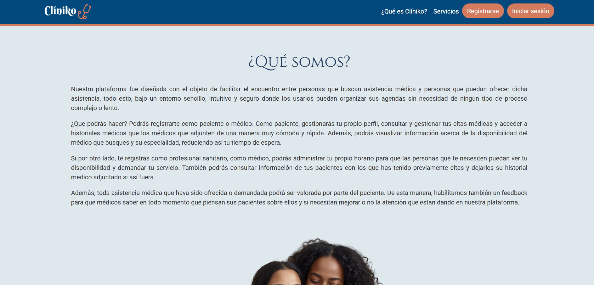
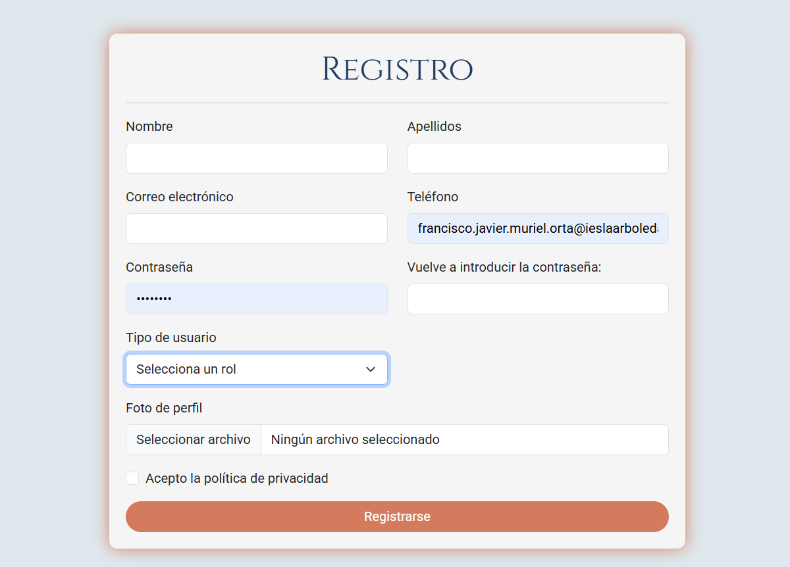
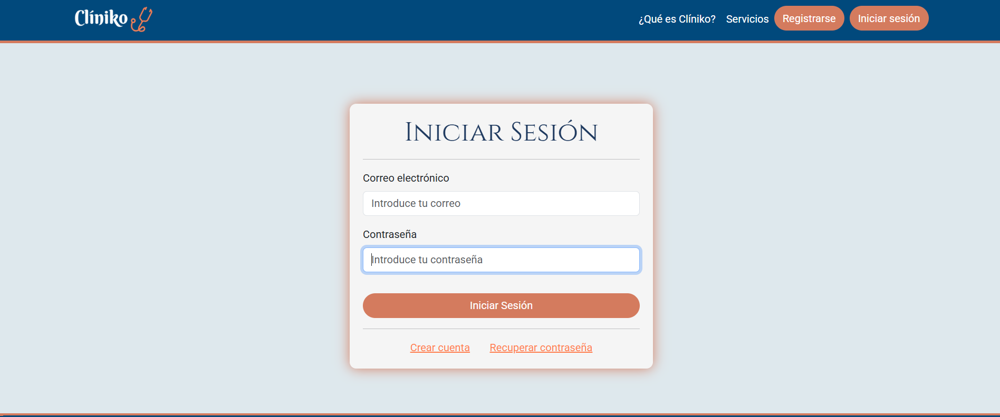
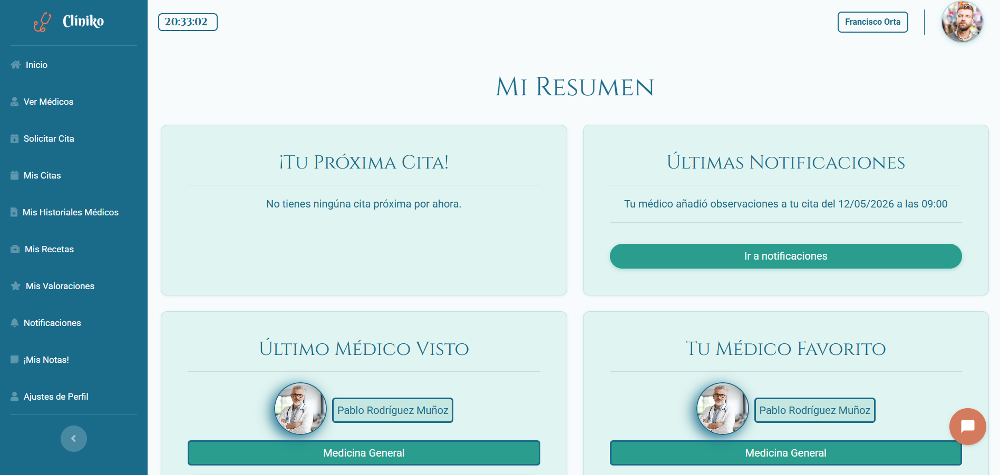
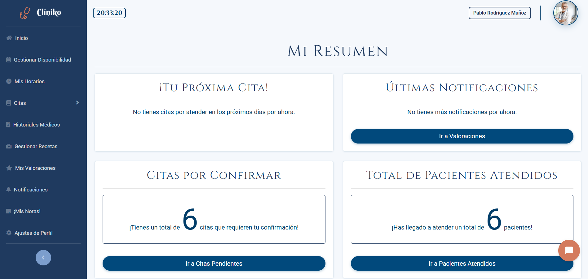
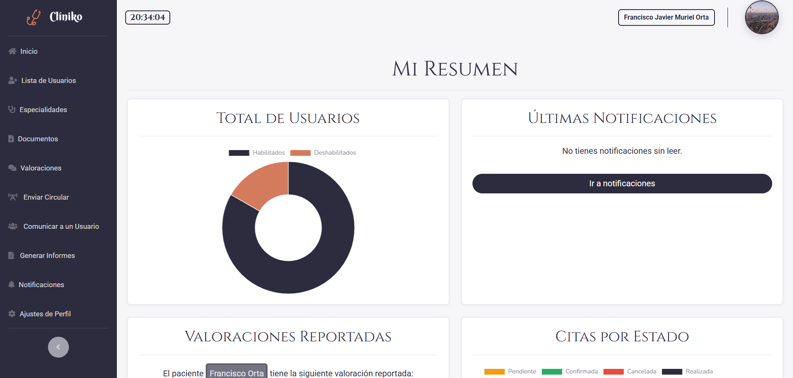

# Clíniko

Aplicación web para citas médicas entre pacientes y médicos.

Clíniko es un proyecto desarrollado como proyecto final del Ciclo Formativo de Grado Superior en Desarrollo de Aplicaciones Web (DAW).  
El objetivo es ofrecer una plataforma digital que facilite la comunicación entre pacientes y médicos, que permita gestionar citas médicas, historiales, crear valoraciones y recibir notificaciones.

# Estructura del proyecto (Modelo – Vista – Controlador)

La aplicación sigue la estructura de carpetas del MVC (Modelo – Vista – Controlador) para mantener la organización.

# Roles y permisos

El usuario paciente  es el usuario que solicita atención médica y puede solicitar, modificar o cancelar citas o valorar médicos y recibir notificaciones por correo. 
El usuario médico es el usuario que ofrece atención sanitaria y puede gestionar sus citas, consultar historiales y recibir valoraciones.
Y el usuario administrador es el usuario encargaado de mantener el funcionamiento del sistema y puede gestionar usuarios, supervisar valoraciones y la configuración general de la web.

# Funcionalidades clave

Gestión completa de citas médicas (CRUD), sistema de roles, envío de notificaciones por correo electrónico, uso de AJAX en operaciones de recarga de la página, listados con filtros y paginación, validaciones en frontend y backend y un diseño responsive con Bootstrap.

# Tecnologías utilizadas

### Backend
- PHP (procedural)
- MySQL con phpMyAdmin

### Frontend
- HTML5
- CSS3
- Bootstrap 5
- JavaScript vanilla
- AJAX con XMLHttpRequest

### Más herramientas emlpeadas.
- XAMPP (servidor local)
- InfinityFree (hosting)
- Git y GitHub (control de versiones)
- Trello (planificación del proyecto)
- Brevo API (envío de correos)
- Tidio (chatbot)
- pdf24.js (generación de PDFs)
- Canva.com
- Imágenes obtenidas de [Freepik](https://www.freepik.com)
  
# Estado del proyecto

⚠️ Este proyecto se encuentra en fase alfa.

# Landing page y páginas públicas

  
  
  

  
  
  

  
  

# Paneles de usuario

  
  
  

# Demo
Puedes ver la aplicación en funcionamiento en el siguiente enlace:
[Clíniko](https://cliniko.infinityfreeapp.com/)

